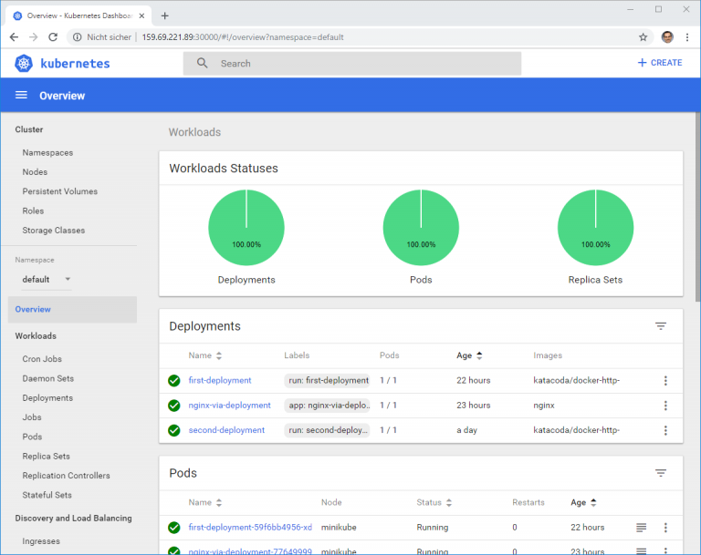

# Minikube

> Minikube is develop to test, It's use only node to run kubernetes.

Working version:
```
Docker: 19.03.2
Minikube: v1.3.1
Kubetcl: v1.15.2
```

#### Install ( docker is need. )

Download minikube:
```
https://github.com/kubernetes/minikube/releases/
```
Install:

- Install kubectl:
```
curl -LO https://storage.googleapis.com/kubernetes-release/release/v1.17.0/bin/linux/amd64/kubectl
mv kubectl /usr/local/bin/
chmod +x /usr/local/bin/kubectl
```

- So install the minikube

```
curl -Lo minikube https://storage.googleapis.com/minikube/releases/latest/minikube-linux-amd64 
mv minikube /usr/local/bin/
chmod +x /usr/local/bin/minikube
```

/etc/docker/daemon.json: nao utilizado

Running minikube:
```
minikube start
```

Running dashboard
```
minikube dashboard
```

Connecting remote dashboard
```
kubectl proxy --address='0.0.0.0' --disable-filter=true
```

Connecting by remote browser
```
http://your_api_server_ip:8001/api/v1/namespaces/kube-system/services/http:kubernetes-dashboard:/proxy/
```

